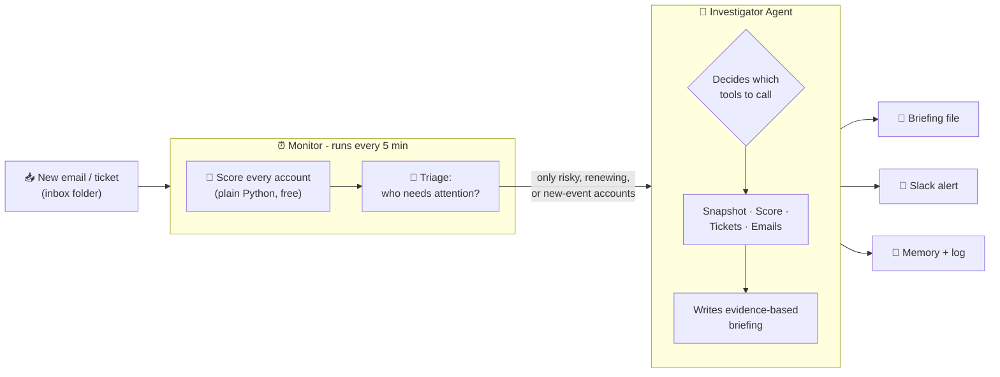
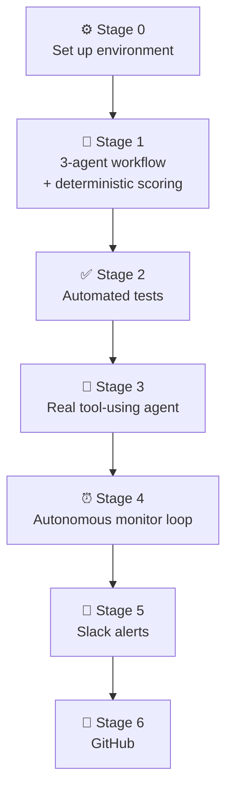
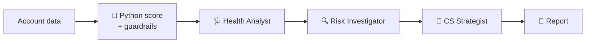
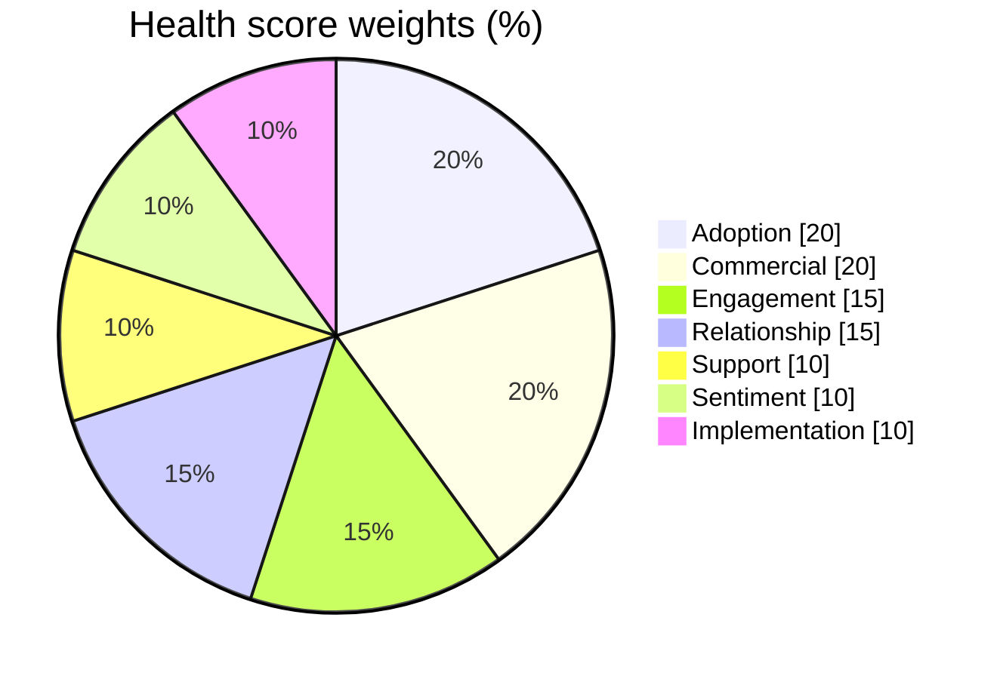
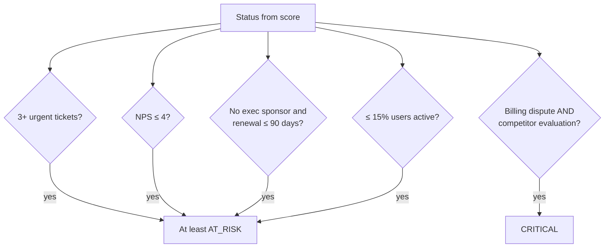
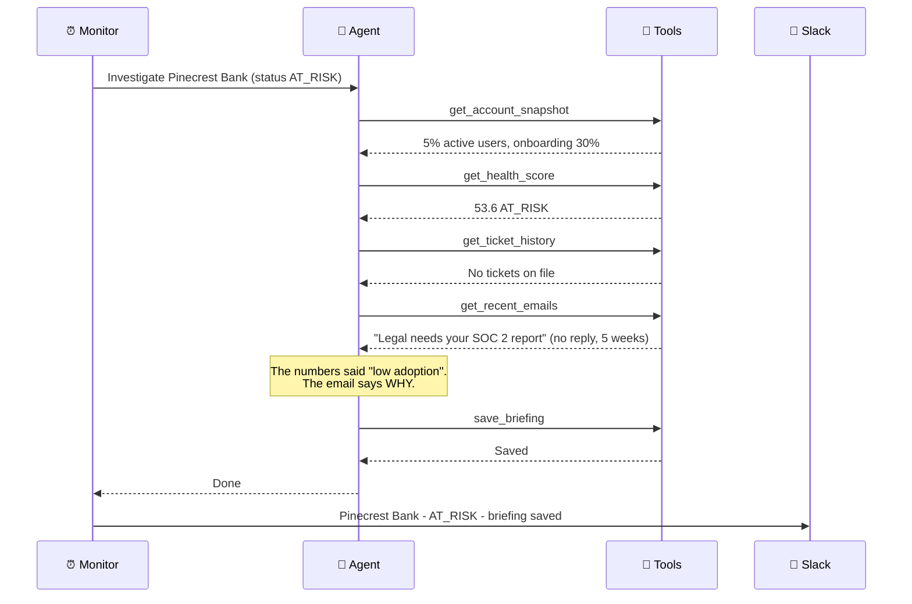
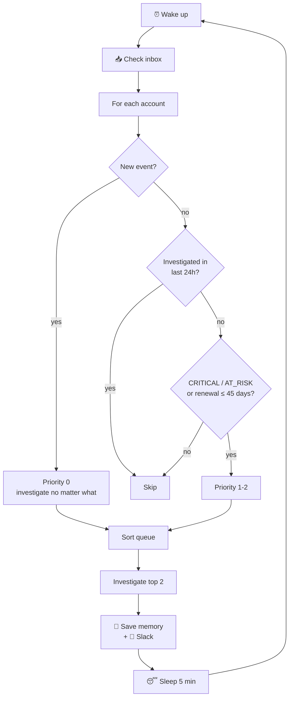
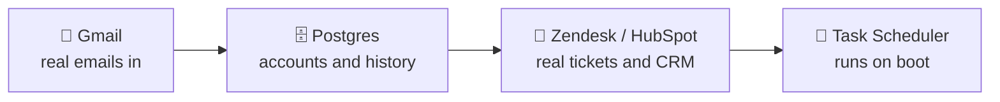

# 🛡️ The Retention Squad

**An autonomous AI agent that watches a portfolio of customer accounts, figures out which ones are quietly heading toward churn, investigates *why*, and pings the team on Slack.**

I built this from zero, as my first coding project, to learn how real AI agents work beyond a chatbot. This README covers what the system does, how it works, every stage I went through to build it, the problems I hit, and the tips I'd give anyone building something similar.


> ⚠️ All customer data in this repository is **fictional**. No real company or customer information is used.

---

## 📌 Table of contents

1. [The problem I wanted to solve](#-the-problem-i-wanted-to-solve)
2. [What the system does (in one picture)](#-what-the-system-does-in-one-picture)
3. [My build journey, stage by stage](#️-my-build-journey-stage-by-stage)
4. [How the health score works](#-how-the-health-score-works)
5. [How the agent thinks](#-how-the-agent-thinks)
6. [How the monitor decides what to look at](#-how-the-monitor-decides-what-to-look-at)
7. [Proof it works](#-proof-it-works)
8. [Mistakes I made (so you don't have to)](#-mistakes-i-made-so-you-dont-have-to)
9. [Things I'd tell anyone building this](#-things-id-tell-anyone-building-this)
10. [Run it yourself](#️-run-it-yourself)
11. [Project structure](#-project-structure)
12. [What's next](#-whats-next)

---

## 🎯 The problem I wanted to solve

In Customer Success, the accounts that churn are often **not** the ones with the worst numbers. The danger tends to hide in places a dashboard doesn't show:

- a champion's email that nobody answered,
- a new executive "reviewing all tool spend",
- a security review stuck waiting on one document.

I wanted a system that does what a great CSM does on a Monday morning: **look at everything, decide what actually matters, dig into the evidence, and recommend a concrete next step.** I also wanted it to do this without being told.

---

## 🧭 What the system does (in one picture)



**Five files, five jobs:**

| Layer | File | Job | Uses AI? |
|---|---|---|---|
| 🧮 **Brain (math)** | `pulse_reader.py` | Scores accounts with fixed business rules plus guardrails | ❌ No, deliberately |
| 🤖 **Agent** | `pulse_agent.py` | Investigates an account using 6 tools it chooses itself | ✅ Yes |
| ⏰ **Autonomy** | `pulse_monitor.py` | Wakes up, triages, hands work to the agent, remembers | ❌ No, it's rules |
| 💬 **Alerts** | `slack_alert.py` | Posts results to Slack | ❌ No |
| ✅ **Safety net** | `test_pulse.py` | 11 automated tests for the scoring math | ❌ No |

> 💡 **Key design decision:** the AI **never** calculates the health score. Python does. The AI only *interprets* and *investigates*. That makes the numbers explainable, repeatable and testable, and AI mistakes can't quietly change a customer's score.

---

## 🛠️ My build journey, stage by stage



### ⚙️ Stage 0: Setting up the environment

**What I did:** I installed Python, created a virtual environment (`venv`) so the project's libraries stay separate from everything else, installed CrewAI, LiteLLM and python-dotenv, and got a free API key from Groq.

**What went wrong:**
- I first installed **Python 3.14**, the newest version. CrewAI's dependencies (like NumPy) didn't have ready-made builds for it on Windows yet, so the install kept failing.
- Windows Notepad didn't want to create files that start with a dot, like `.env` and `.gitignore`.

**How I fixed it:**
- Switched to **Python 3.12.7** and created the venv with `py -3.12 -m venv venv`.
- Wrote `notepad .env.`, with a trailing period, which Windows quietly strips.

**💡 Lesson:** *The newest version isn't always the right version.* AI libraries usually lag a few months behind new Python releases.

---

### 🔁 Stage 1: A 3-agent workflow plus a scoring engine

**What I built:** a Python scoring engine that turns each account's raw data into a 0–100 health score across 7 dimensions, then three CrewAI roles that run in sequence:



**What went wrong:**
1. **The model I picked was retired.** Groq deprecated `llama-3.3-70b-versatile`, so I switched to `openai/gpt-oss-120b`.
2. **Groq rejected CrewAI's messages** with `property 'cache_breakpoint' is unsupported`. CrewAI adds a hidden marker that Groq's API doesn't accept.
3. **Strict structured output failed.** I'd asked the agents to return exact Pydantic objects, and the model kept returning plain text instead.
4. **A blind spot in my scoring.** *Orbit Learning* scored 75 (WATCH) because usage was high and the champion was happy, while it actually had **4 urgent tickets and an NPS of 4**. The average was hiding a fire.

**How I fixed it:**
1. Changed one line: the model name.
2. Wrote a small patch that strips `cache_breakpoint` from every message before it's sent to Groq.
3. Dropped strict Pydantic output and asked for structured Markdown sections instead.
4. Added **guardrails**, rules that can only make a status *worse*, never better. Orbit Learning now correctly escalates to **AT_RISK**.

**💡 Lesson:** *Averages hide emergencies.* A weighted score needs override rules for "this alone is serious enough."

---

### ✅ Stage 2: Automated tests

**What I built:** `test_pulse.py`, 11 tests that check the scoring math **without calling the AI**, so they're free and run instantly.

They check things like:
- every account gets exactly the expected score and status,
- scores always stay between 0 and 100,
- **more urgent tickets never *raise* a score** (monotonicity),
- guardrails never improve a status,
- a billing dispute plus a competitor evaluation always forces **CRITICAL**,
- missing data doesn't crash anything.

Result: **11/11 passing.**

**💡 Lesson:** *Test the parts that must never be wrong.* You can't unit-test an AI's opinion, but you can test the math it depends on.

---

### 🤖 Stage 3: Turning the workflow into a real agent

This is where I learned the difference between a **workflow** and an **agent**:

| | Workflow (Stage 1) | Agent (Stage 3) |
|---|---|---|
| Who decides the steps? | Me, hard-coded in order | The AI, at runtime |
| Uses tools? | No | Yes, 6 of them |
| Can look for missing info? | No, it sees only what I pass in | Yes, it goes and fetches it |
| Knows when it's done? | Always runs all 3 steps | Stops when it has enough evidence |

**What I built:** one investigator agent with six tools:

| Tool | What it returns |
|---|---|
| `get_portfolio_overview` | All accounts with scores and statuses |
| `get_account_snapshot` | Raw data for one account |
| `get_health_score` | The Python-calculated score breakdown |
| `get_ticket_history` | Support tickets (simulated) |
| `get_recent_emails` | Customer emails (simulated) |
| `save_briefing` | Saves the final briefing to a file |

**How I tested it honestly:** I planted **hidden facts** in the simulated emails and tickets that do **not** appear anywhere in the numbers. The agent can only find them by actually using its tools:

| Account | Hidden fact (only in emails or tickets) |
|---|---|
| Pinecrest Bank | Rollout blocked: legal is waiting on our **SOC 2 report**, with 5 weeks unanswered |
| Crimson Energy | Renewal quote shows **+18%**, but they were promised 5% |
| Nova Retail Co. | A new **VP Operations** is reviewing all tool spend |
| Helix Health | Procurement is collecting **price comparisons** |
| Zenith Manufacturing | New contact **Priya** doesn't know what the tool is for |
| BrightPath, Stellar, Redwood | *No history at all*, to test that the agent admits it instead of inventing |

**What went wrong:**
1. **My code got cut off when I pasted it** into Notepad, giving `SyntaxError: '(' was never closed`.
2. **Groq rejected a tool with zero inputs**: `'required' present but 'properties' is missing`.

**How I fixed it:**
1. Got into the habit of running `python -m py_compile file.py` after every paste. No output means the file is complete.
2. Gave the tool a harmless optional input, `scope: str = "all"`.

**💡 Lesson:** *Different AI providers have different rules for tool definitions.* Something that works on one provider can be rejected by another.

---

### ⏰ Stage 4: Making it autonomous

An agent that only runs when I type a number isn't autonomous. So I built a **monitor**: a loop that runs by itself, decides what deserves attention, and remembers what it already did.

**Key features:**
- 🔁 Wakes up every **5 minutes**
- 📥 Reads new events dropped into an `inbox/` folder
- 🚦 Prioritises: new events → CRITICAL → AT_RISK → renewals within 45 days
- 🧊 **24-hour cooldown**, so it never re-investigates the same account in a loop
- 🔄 **Retries failures** after 30 minutes instead of giving up
- 🪙 Investigates at most **2 accounts per cycle** to stay inside the free API limits
- 🧠 Saves its memory to `monitor_state.json`, so it picks up where it left off after a restart

**The test that convinced me:** while the monitor was running, I dropped this email into the inbox for **BrightPath Logistics**, the *healthiest* account (92.9):

```
ACCOUNT: BrightPath Logistics
TYPE: email
Our new CFO has put a freeze on all vendor purchases until the end of the quarter
and wants to review every contract.
```

On score alone, the monitor would never touch BrightPath. Here's what my log showed:

```
[02:22:33] NEW EVENT (email) for BrightPath Logistics: Our new CFO has put a freeze on all vendor purchases...
[02:22:33] 6 account(s) need attention. Investigating up to 2 this cycle.
[02:22:33] INVESTIGATING BrightPath Logistics - new event: event1.txt
[02:22:41] DONE BrightPath Logistics - Briefing saved to briefings\..._brightpath_logistics_immediate_action_.md
```

It noticed the event, moved a healthy account to the front of the queue, and investigated it **without me doing anything.**

**💡 Lesson:** *Autonomy isn't just a loop. It's a loop plus judgment plus memory.*

---

### 💬 Stage 5: Slack alerts

**What I built:** `slack_alert.py` uses a Slack **Incoming Webhook**, which is free and needs no paid plan. After every investigation, the monitor posts:

```
*Pinecrest Bank* - AT_RISK (score 53.6)
Why I looked: status AT_RISK (score 53.6)
Briefing saved to briefings\20261009_191940_pinecrest_bank_at_risk_account_briefing.md
```

**What went wrong (this stage taught me the most about practical engineering):**
1. Pasting code into Notepad **lost all the indentation**, so Python failed with `IndentationError`.
2. I accidentally ran an **old copy** of the monitor without the Slack code, so it worked but stayed silent.
3. My Slack test passed in one folder, but the URL was missing from **this** project's `.env`.
4. While editing `.env`, I **pasted the Slack URL over my Groq key**, and the agent started failing with `Invalid API Key`.
5. PowerShell blocked `venv\Scripts\activate` with "running scripts is disabled".

**How I fixed it:**
1. Used tiny helper scripts where every line starts at the left edge, so nothing can lose its indentation. They write the real file with correct spacing.
2. Checked the file with `findstr "send_slack" pulse_monitor.py`. An empty result told me the alert code wasn't there.
3. Made sure `.env` lives **in the project folder** and contains **both** keys, each on its own line.
4. Created a fresh Groq key and replaced only the text after `GROQ_API_KEY=`.
5. Skipped activation and ran Python straight from the venv: `venv\Scripts\python pulse_monitor.py`.

**💡 Lesson:** *Most bugs weren't in the AI. They were in files, folders, keys and copy-paste.* Checking "is the file I think I'm running the file that's actually running?" saved me hours.

---

## 🧮 How the health score works

Each account gets a score per dimension (0–100), combined with these weights:



| Score | Status |
|---|---|
| ≥ 80 | 🟢 HEALTHY |
| 65 – 79.9 | 🟡 WATCH |
| 45 – 64.9 | 🟠 AT_RISK |
| < 45 | 🔴 CRITICAL |

**Then the guardrails run**, and they can only make things worse:



**Results on the 9 sample accounts:**

| Account | Score | Final status | Note |
|---|---|---|---|
| Helix Health | 39.1 | 🔴 CRITICAL | |
| Pinecrest Bank | 53.6 | 🟠 AT_RISK | |
| Nova Retail Co. | 54.3 | 🟠 AT_RISK | |
| Zenith Manufacturing | 63.0 | 🟠 AT_RISK | |
| Redwood Telecom | 66.4 | 🟡 WATCH | |
| Orbit Learning | 75.1 | 🟠 AT_RISK | ⬆️ escalated from WATCH by guardrails |
| Crimson Energy | 77.8 | 🟡 WATCH | |
| Stellar Fintech | 84.7 | 🟢 HEALTHY | |
| BrightPath Logistics | 92.9 | 🟢 HEALTHY | |

---

## 🤖 How the agent thinks

This is roughly what happens during one investigation. The agent chooses each call itself:



---

## 🚦 How the monitor decides what to look at



---

## 🔎 Proof it works

**A real briefing the agent wrote for Pinecrest Bank** (excerpt):

> ### What the Numbers Miss
> - The low adoption and implementation scores hide a **security-review bottleneck** that is preventing rollout to end users.
> - No tickets are logged because the issue is **pre-support**: the customer is waiting on documentation rather than raising a ticket.
>
> ### Evidence
> - *Email (5 weeks ago, IT admin):* "We are waiting on our security review before rolling out to staff. Legal needs your SOC 2 report."
>
> ### Recommended Actions
> | Priority | Action | Owner | Deadline |
> |---|---|---|---|
> | **P0** | Send the latest SOC 2 audit report to the IT administrator and confirm receipt. | CSM | 2 business days |

The score said *"low adoption."* The agent found out **why**, using a fact that exists only in an email, and turned it into a specific action with an owner and a deadline.

---

## 🧯 Mistakes I made (so you don't have to)

| # | Problem | What I saw | Fix | Tip |
|---|---|---|---|---|
| 1 | Too-new Python | Install errors building NumPy | Use Python **3.12** | Check library support before upgrading |
| 2 | Can't create `.env` on Windows | Notepad refuses or renames it | `notepad .env.` (trailing dot) | Run `dir` to confirm the real filename |
| 3 | Deprecated model | Model not found | Change the one `MODEL_NAME` line | Keep the model name in **one** place |
| 4 | `cache_breakpoint` rejected | Groq 400 error | Strip the key before sending | Read the full error, since it names the exact field |
| 5 | Zero-input tool rejected | `'required' present but 'properties' is missing` | Add an optional input | Every tool needs at least one input on Groq |
| 6 | Truncated paste | `SyntaxError ... never closed` | Re-paste the missing part | **Always** run `python -m py_compile file.py` |
| 7 | Lost indentation | `IndentationError` | Write files with a generator script | Never trust a long paste into Notepad |
| 8 | Running an old file | Code ran but no Slack alerts | Replace the file, verify with `findstr` | Check the file actually contains your change |
| 9 | Key overwritten | `Invalid API Key` | New key, one key per line | Edit only the part **after** the `=` |
| 10 | Keys pasted into chat | Security risk | Delete and recreate the keys | Treat any key that leaves `.env` as compromised |
| 11 | PowerShell blocks `activate` | `UnauthorizedAccess` | `venv\Scripts\python file.py` | You don't *need* to activate a venv |
| 12 | Hitting rate limits | `Max RPM reached` | `max_rpm=20`, 2 accounts per cycle | Slow and steady beats crashing |

---

## 🧠 Things I'd tell anyone building this

**🔐 Security**
- API keys live **only** in `.env`, and `.env` is in `.gitignore` so it never reaches GitHub.
- If a key is ever pasted anywhere (chat, screenshot, email), **rotate it** by deleting it and making a new one.
- Ship a `.env.example` with placeholder values so others know what's needed.

**🏢 Data privacy**
- Everything the agent reads gets sent to the AI provider. **Don't connect real customer data without your company's approval.**

**🎯 Reliability**
- Let **code** do math and rules; let **AI** do reading, reasoning and writing.
- Make the agent say "no data on file" instead of guessing, and test that it does.
- Plant hidden facts to check the agent really uses its tools.

**💸 Cost and limits**
- Triage first. Only the accounts that need it go to the AI. Healthy, quiet accounts cost nothing.
- Cap the work per cycle and add pauses so you stay inside free-tier limits.

**🧪 Debugging habits that saved me**
- `python -m py_compile file.py` after every edit.
- `findstr "something" file.py` to confirm a change is really in the file.
- Read the **last** lines of an error first. That's usually where the real reason is.
- Change **one thing at a time**, then test.

---

## ▶️ Run it yourself

```bash
# 1. Set up (Windows)
py -3.12 -m venv venv
venv\Scripts\python -m pip install -r requirements.txt

# 2. Add your keys
copy .env.example .env
notepad .env
#   GROQ_API_KEY=your_groq_key
#   SLACK_WEBHOOK_URL=your_slack_webhook   (optional)

# 3. Run
venv\Scripts\python test_pulse.py          # tests - no API needed
venv\Scripts\python pulse_reader.py        # 3-role workflow
venv\Scripts\python pulse_agent.py         # tool-using agent (pick an account)
venv\Scripts\python slack_alert.py         # send a Slack test message
venv\Scripts\python pulse_monitor.py       # autonomous mode (Ctrl+C to stop)
venv\Scripts\python pulse_monitor.py --once  # one cycle, for a scheduler
```

**Try the reactive demo:** while the monitor is running, create `inbox\event1.txt`:

```
ACCOUNT: BrightPath Logistics
TYPE: email
Our new CFO has put a freeze on all vendor purchases until the end of the quarter.
```

Within 5 minutes it will investigate BrightPath and alert Slack.

---

## 📁 Project structure

```
the-retention-squad/
├── pulse_reader.py     # 🧮 scoring engine + guardrails + 3-role workflow
├── pulse_agent.py      # 🤖 tool-using investigator agent
├── pulse_monitor.py    # ⏰ autonomous loop: triage, memory, retries
├── slack_alert.py      # 💬 Slack webhook alerts
├── test_pulse.py       # ✅ 11 automated tests (no API needed)
├── requirements.txt
├── .env.example        # template for your keys
├── briefings/          # 📄 briefings written by the agent
├── reports/            # 📄 reports written by the workflow
├── monitor_log.md      # 🧠 what the monitor did and when
└── (.env, venv/, inbox/, monitor_state.json are kept out of Git)
```

---

## 🔭 What's next



- **Gmail** instead of the `inbox/` folder, so real messages trigger investigations
- **Postgres** (Neon or Supabase) to store accounts, tickets and briefings
- **CRM and ticketing** integrations
- **Windows Task Scheduler** so the monitor starts on its own
- A **benchmark** comparing the workflow and the agent on cost, speed, and how many hidden facts each one finds

---

## 💬 What I learned

- An **agent** isn't a chatbot. It's a model with **tools, a goal and the freedom to choose its steps**.
- **Autonomy** means three things together: a trigger (the loop), judgment (triage) and memory (state).
- The most valuable part of the system is the **boring part**: deterministic scoring, guardrails and tests. That's what makes the AI part trustworthy.
- Most real-world problems weren't "AI problems." They were about environments, files, keys and APIs, and learning to debug those calmly is a skill in itself.

---

*Built step by step as my first coding project, with Claude as my pair-programming guide.*
